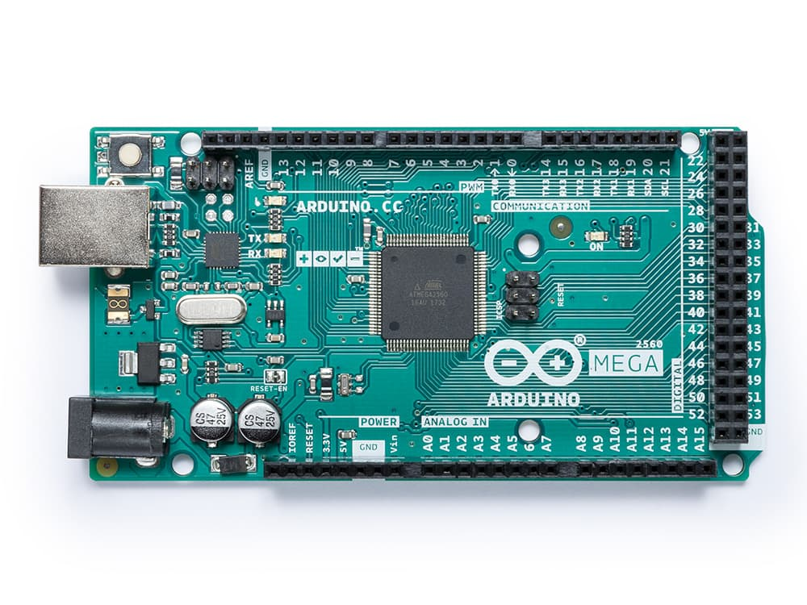
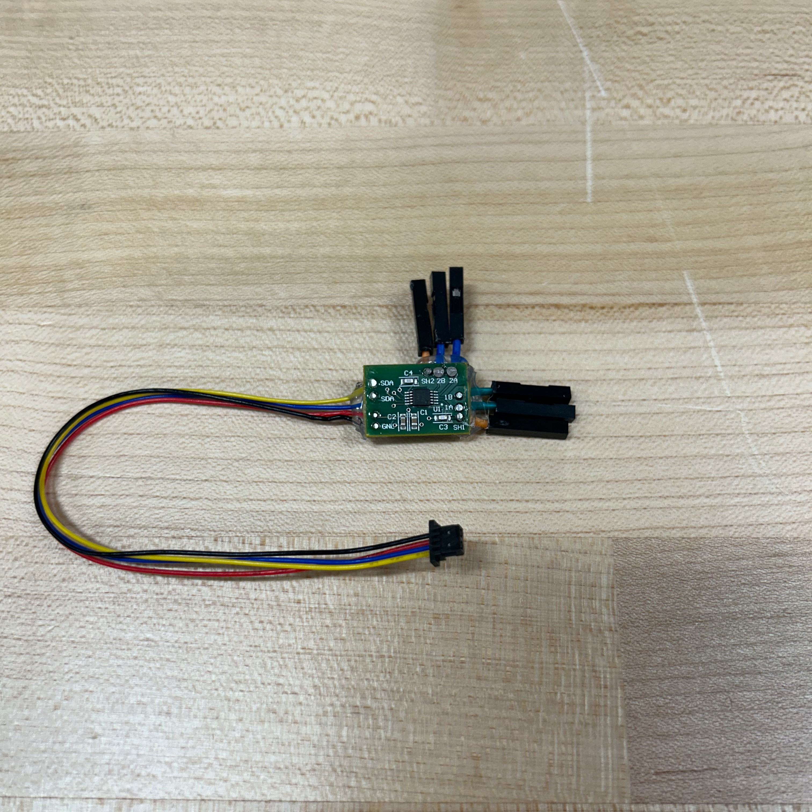
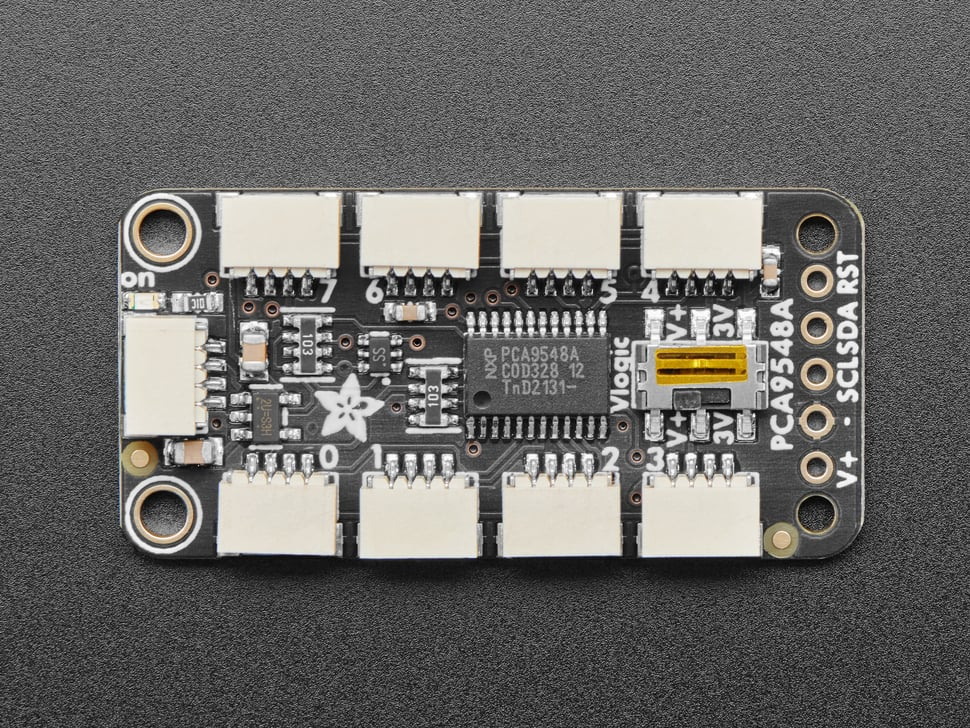
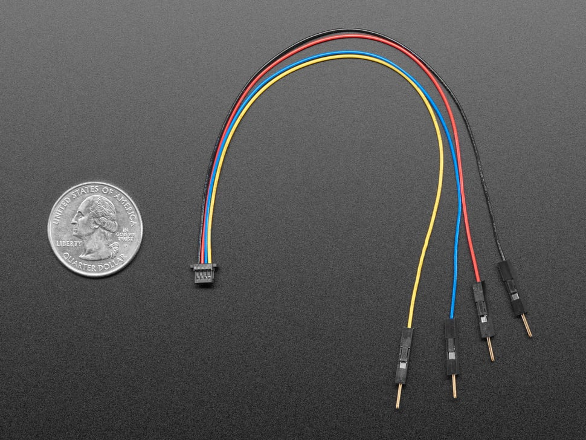
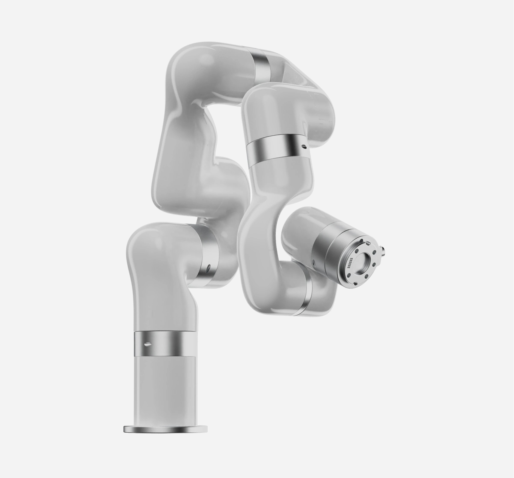

# Capacitive-Sensing-Sleeve
This repository contains documentation and up-to-date arduino and python scripts to control the xArm via capacitive sensors.

It also consolidates relevant work done in:
* [Katelyns repository](https://github.com/Wesleyan-Soft-Robots-Lab/kmccall-sensor-computation/tree/main)
* [Pattons repository](https://github.com/Wesleyan-Soft-Robots-Lab/proximity_sensing_test)

## Table of Contents
* [Directory](#folder-directory)
* [Hardware Components](#hardware)  
   * [Capacitive Sensor](#capacitive-sensor)
      * [How to Create](#learn-how-to-create-your-own-patch-here)
   * [Microcontroller](#arduino-mega-2560)
   * [FDC1004](#fdc1004)
      * [How to Solder More](#soldering-more-chips)
      * [Order More PCBs](#order-more-pcbs)
   * [Multiplexor](#pca9548a-i2c-multiplexor)
      * [Order More Mux's](#order-more-multiplexors)
   * [Qwiic Cables](#qwiic-connect-cables)
   * [Robot Arm](#xarm6)
      * [First-time Setup](#connecting-to-xarm-first-time)
* [Setting Up Hardware](#hardware-setup)
* [Software Guide](#software-guide)
* [Improve Project](#expanding-the-project)
* [Helpful Information](#helpful-information)
* [Credits](#credits)

## Folder Directory
*subject to change
```
├───README.md                                      <-- You are Here
├───doc/...                                                 # folder for files related to documentation
├───Scripts/                                                
│   ├───Arduino/                                            # folder for scripts run on arduino
│   │   ├───extra/                                          # extra files used to sandbox 
│   │   │   ├───Demo-singleCap.ino
│   │   │   ├───mux_daisy-chain_demo.ino
│   │   │   ├───new_protocentral_demo.ino
│   │   │   └───new_protocentral_multiCap-notWorking.ino 
│   │   ├───fast_multiCap.ino                               # fastest code for reading sensors
│   │   └───multiCap.ino                                    # older ver. to keep old .py scripts working
│   └───Python/
│       ├───outdated/
│       |   └───communication.py                            # used with multicap.ino so old files work
│       ├───wip scripts/                                    # buggy files for sandboxing
|       |   ├───api-testing.py
|       |   ├───camera-bug.py
|       |   ├───PID_arm.py
|       |   ├───record_data.py 
|       |   └───record_sensor-arm_data.py
│       ├───xArm Behaviors/                                 # .py code for xArm control
|       |   ├───arm.py 
|       |   ├───follow_hand.py
|       |   └───follow_handGUI.py                           # follow_hand.py but with GUI
|       ├───calibration_config.json                         # .json saves settings for  
|       |                                                      sensor calibration 
|       ├───gui.py                                          # runs receiver.py but with GUI
|       └───receiver.py                                     # barebones .py to read arduino xmit
└───tests/                                                  # folder for test data, and videos
    ├───data/
    │   ├───off-arm_data/...
    │   ├───on-arm_data/...
    │   └───sensor-arm-data/...
    └───video/
```
## Hardware
### Capacitive Sensor


Our sensors are simple, cheap, easy to create, elastic tubes stuffed with a conductive material and knitted into whatever shape is required. The result is a squishy, tactile patch that behaves like a capacitor and is ideal for pacifying hard surfaces and edges.

The patches are the main focal point of this research project. If you are looking to expand or improve, this is a great area to explore, experiment, and break things ;)

#### Learn how to create your own patch [here](doc/creating-capacitive-patch.md)
### Arduino MEGA 2560


To communicate among the sensors we use an arduino mega which supports [I2C](https://learn.sparkfun.com/tutorials/i2c/all) communication. While there *is* a way to read from the sensors just via analog pins, I2C reduces the amount of wires from the arduino to just four pins: 3.3v, GND, SDL, and SCL pins. This organizes and simplifies the wiring, allowing us to daisy chain together even more sensors. 

The Arduino Mega 2560 rev 3 supports I2C speeds of up to 400kHz, though [faster speeds]() do exist.

Arduino Mega [pinout](https://docs.arduino.cc/resources/pinouts/A000067-full-pinout.pdf), [datasheet](https://docs.arduino.cc/resources/datasheets/A000067-datasheet.pdf)

TODO:
+ check links

### FDC1004


The FDC1004 measures the capacitance charge of up to four channel inputs and has two inputs for shielding.

Without getting too technical, the chip works by forcing electrons into the inputs and measuring the "pushback" felt. Applying force on an input sensor allows the electrons to "drain" at a steady rate, resulting in a lower "pushback".

In other words, If the sensor is resisting more electrons, the FDC reads a lower value, and conversly, if the sensor is able to recieve more electrons, a higher value is read. Thus, only **one** connection to the patch is needed (don't connect the patch to ground).

#### [FDC datasheet](https://www.ti.com/lit/ds/symlink/fdc1004.pdf?ts=1726805458775) (pdf)

#### Soldering More Chips
This is the only soldering required throughout the project-- [here's how](doc/soldering-fdc.md).
#### Order more PCBs
See [link](https://github.com/Wesleyan-Soft-Robots-Lab/kmccall-sensor-computation/blob/main/capacitance/README-cap.md) about ordering more chips.
* FDC1004: [FDC1004QDGSTQ1](https://www.digikey.com/en/products/detail/texas-instruments/FDC1004QDGSTQ1/6571852)
* R1, R2: [4.99k Ohm Surface-Mounted Resistor](https://www.digikey.com/en/products/detail/te-connectivity-passive-product/CPF0603F4K99C1/2384513)
* C1: [1 microFarad Surface-Mounted Capacitor](https://www.digikey.com/en/products/detail/yageo/CC0603KRX7R7BB105/2833611)
* C2: [.1 microFarad Surface-Mounted Capacitor](https://www.digikey.com/en/products/detail/yageo/CC0603KRX7R7BB104/302822)
* C3, C4: [51 picoFarad Surface-Mounted Capacitor](https://www.digikey.com/en/products/detail/kemet/C0603C510J5GAC7867/2200925)


### PCA9548A I2C Multiplexor


Adafruits PCA9548A allows up to 8 connections to I2C devices. This includes other PCA multiplexors, in theory we can daisy-chain an unlimited amount of devices together, but we are limited by the I2C communication speed. 

[Learn more](https://learn.adafruit.com/adafruit-pca9548-8-channel-stemma-qt-qwiic-i2c-multiplexer/pinouts)

#### [Order more multiplexors](https://www.adafruit.com/product/5626)

### Qwiic connect cables


The use of Qwiic connect cables eliminate the need to solder.
- Red - 3.3VDC Power
- Black - Ground
- Blue - I2C SDA Data
- Yellow - I2C SCL Clock


### xArm6


* [api](https://github.com/xArm-Developer/xArm-Python-SDK/blob/master/doc/api/xarm_api.md)
* [User manual](https://www.ufactory.cc/wp-content/uploads/2023/05/xArm-User-Manual-V2.0.0.pdf)
#### <u> Connecting to xArm (First Time)</u>:
1. Flip the power switch on the AC Control Box. All leds should be lit (Flickering LAN leds are OK). (Double check all cables are properly connected and "Emergency Stop" button isn't pushed down, if so twist it)
2. On the Control Box is a sticker with an IP address labeled **192.168.232** !Remember it or where to find it!
3. Configure IP Address:
    ##### Windows 11:
    1. Open your **Control Panel**
    2. Navigate to: <u>Network and Internet</u> > <u>Network and Sharing Center</u>
    3. On the lefthand side click **Change adapter settings**
    4. Right click on the correct ethernet device and select **Properties** in the dropdown
    5. Scroll down and select <u>Internet Protocol Version 4 (IPv4)</u>, then hit **Properties**
    6. Set IP: **192.168.1.x**; and Subnet Mask: **255.255.255.0** (x can be anything from 0-255. **! Do NOT choose same ip as sticker !**)
    7. Hit **OK** and **Close** to confirm settings
    ##### Mac:
    1. Connect the ethernet cable from the arm set up to your computer
    2. navigate to system settings --> Network --> Ethernet.
    3. Select **<u>USB 10/100/1000LAN</u>** --> click **details** --> **TCP/IP**, and set **<u>configure IPv4</u>** to **manually**
    4. Set IP: **192.168.1.x**; and Subnet Mask: **255.255.255.0** (x can be anything from 0-255. **! Do NOT choose same ip as sticker !**), confirm settings.
4. When connecting to the arm in UFactory or Python, use the IP address labeled on the AC Control Box.

### Download and set up UFactory studio app:
   1. [download ufactory studio app on your machine](https://www.ufactory.us/ufactory-studio)
   2. open and enter 192.168.1.232(IP address found on the arm block sticker) into the search bar
   3. click connect, and explore the options of arm controll 
   
   **NB MAC USERS :** The studio app may flag as unsafe and fail to open the first time. Go to system settings, scroll down and click privacy and security. Then scroll to the bottom and you will see the app listed as an unsafe app that tried to open, click allow anyway

## Hardware Setup
1. Follow diagram for connecting wires: insert diagram
2. if you want to change the address pins for more obvious code when daisy-chaining multiplexors see [link](https://learn.adafruit.com/adafruit-pca9548-8-channel-stemma-qt-qwiic-i2c-multiplexer/pinouts#address-pins-3129199) about soldering address pins
## Software Guide
The Scripts folder is sorted into arduino code and python code. For the arduino, the only two significant scripts are [multiCap.ino](Scripts/Arduino/multiCap/multiCap.ino) and [fast_multiCap.ino](Scripts/Arduino/fast_multiCap/fast_multiCap.ino). 

For running the newer python scripts the arduino uses [fast_multiCap.ino](Scripts/Arduino/fast_multiCap/fast_multiCap.ino)
For arduino libraries you must use Protocentrals fdc1004
## Expanding the Project
Various task, suggestions, and experiments have been listed in the [Issues](https://github.com/Wesleyan-Soft-Robots-Lab/Capacitive-Sensing-Sleeve/issues) tab in the repository. It would be greatly appreciated to maintain this workflow for progress tracking and overall project management. Feel free to raise your own issues and create more labels!!
## Helpful Information
* [Measuring a Single Capcitor](https://github.com/Wesleyan-Soft-Robots-Lab/kmccall-sensor-computation/blob/main/capacitance/README-cap.md?plain=1#additional-resources)
* [xArm sdk](https://github.com/xArm-Developer/xArm-Python-SDK)
## Credits
- EmPRISE lab at Cornell Univerisity
- Sonia Roberts
- Miles Modeste
- Yamani Mpofu
- Katelyn McCall
- Patton Yin
