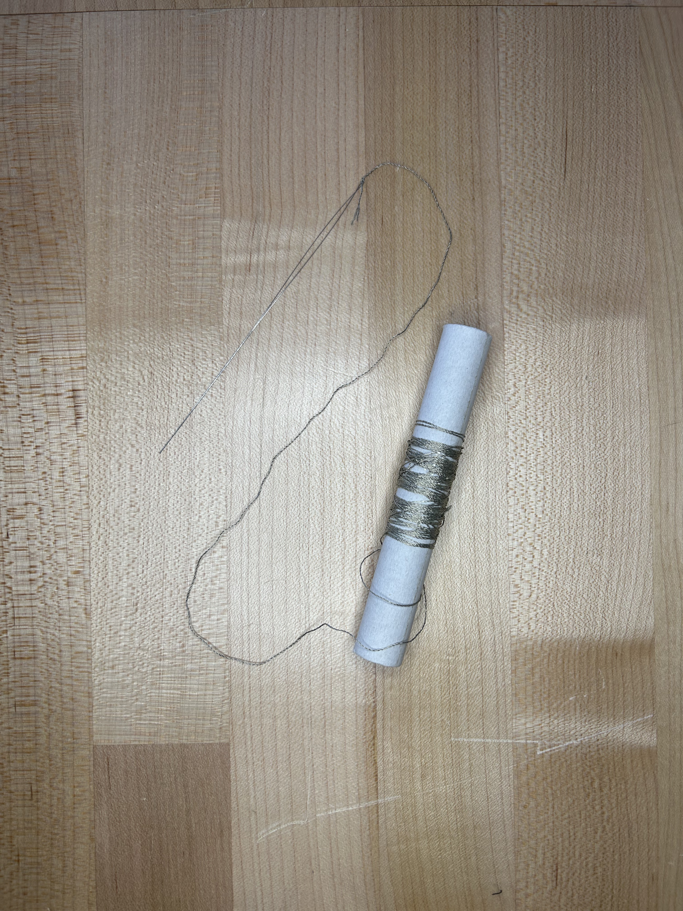

# Creating a Capacitive Sensor
[back](../README.md#capacitive-sensor)

## 1. Search around the lab for a skinny needle and the conductive thread

## 2. Measure out some length of tubing. 
The longer the tube the more it tends to bunch. For a 2x2cm patch I would recommend ~2 feet.

## 3. Thread needle through tube
<video width="500px" controls>
    <source src="images/patch/ThreadingProcess.mp4" type="video/mp4">
</video>

Thread the needle throught the tube by pinching the front-end of the needle and with your other hand stretch the tube across the back. With that other hand pinch the back-end and release the front end, letting the tube relax and progressing the needle forward.

## 4. Knit your desired shape.

## 5. Crimp one end

<video width="500px" controls>
  <source src="images/patch/Crimp.mp4" type="video/mp4">
</video>

dont forget to add a cap... which I did.

[back](../README.md#capacitive-sensor)