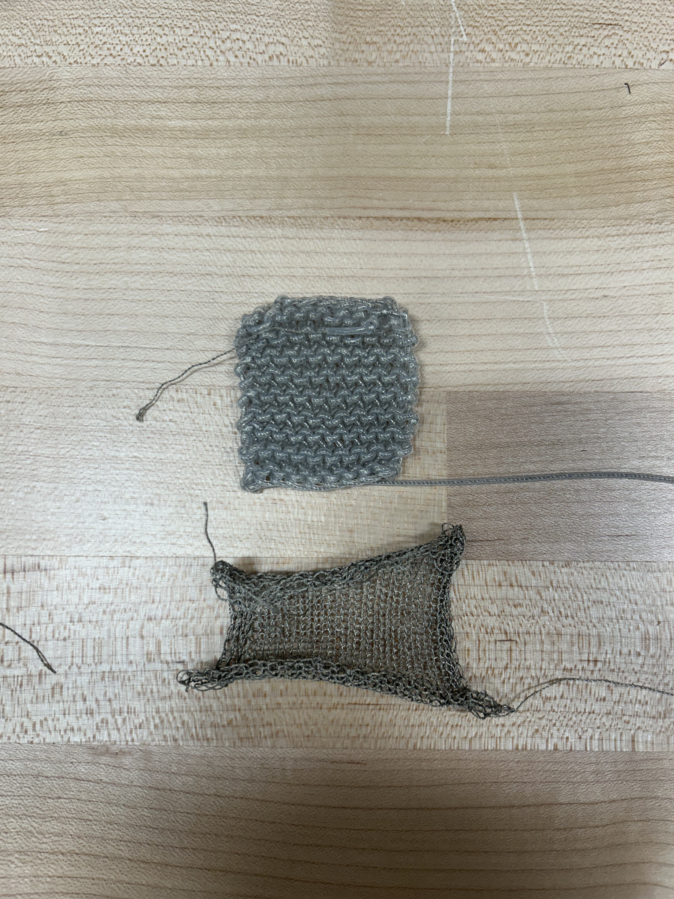
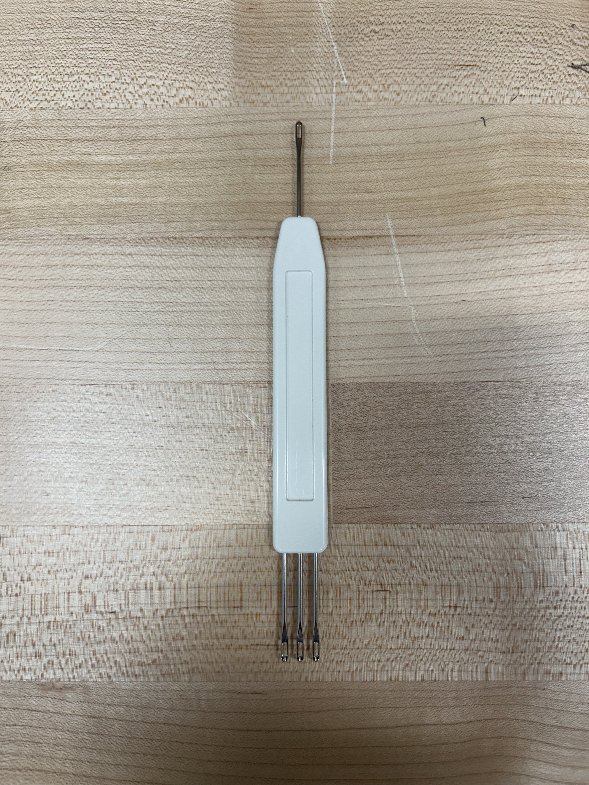
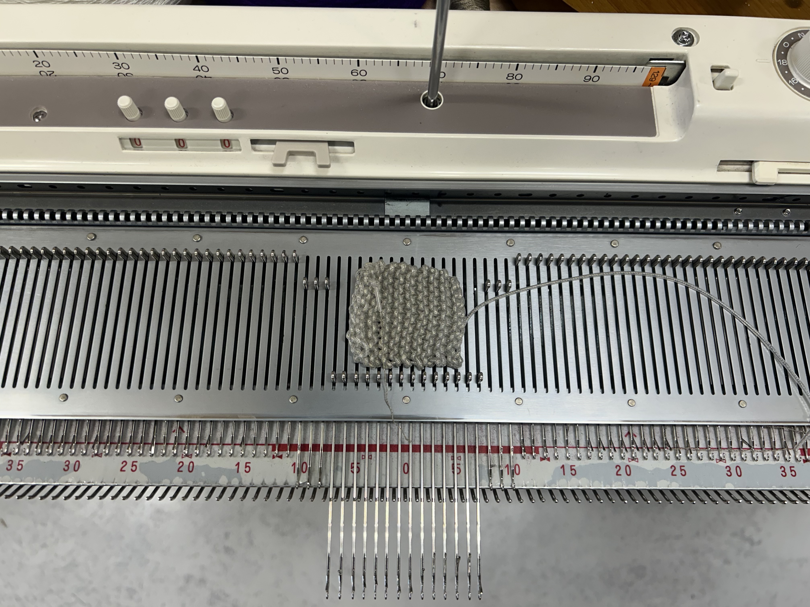
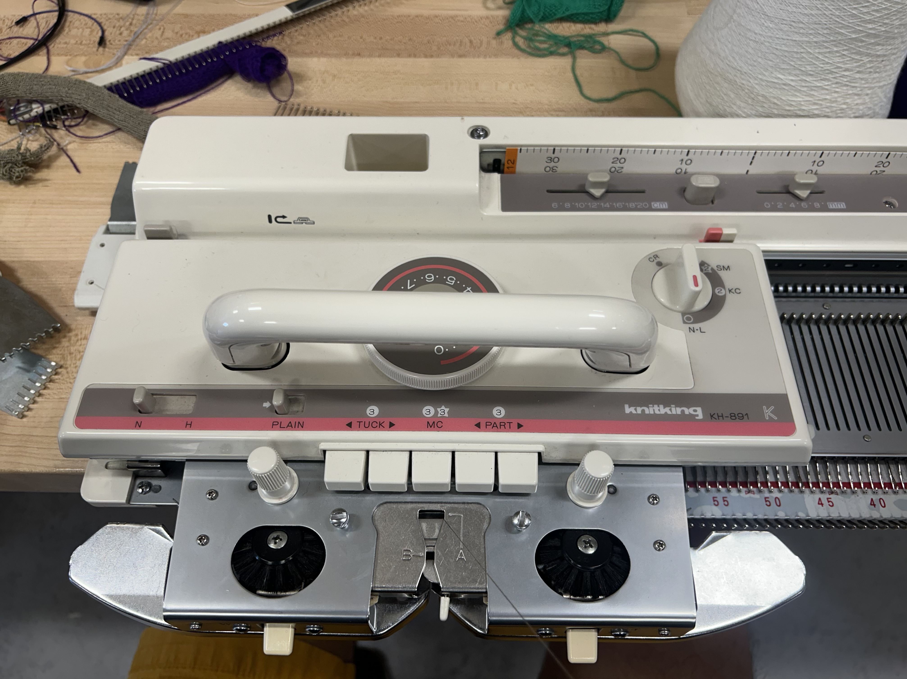
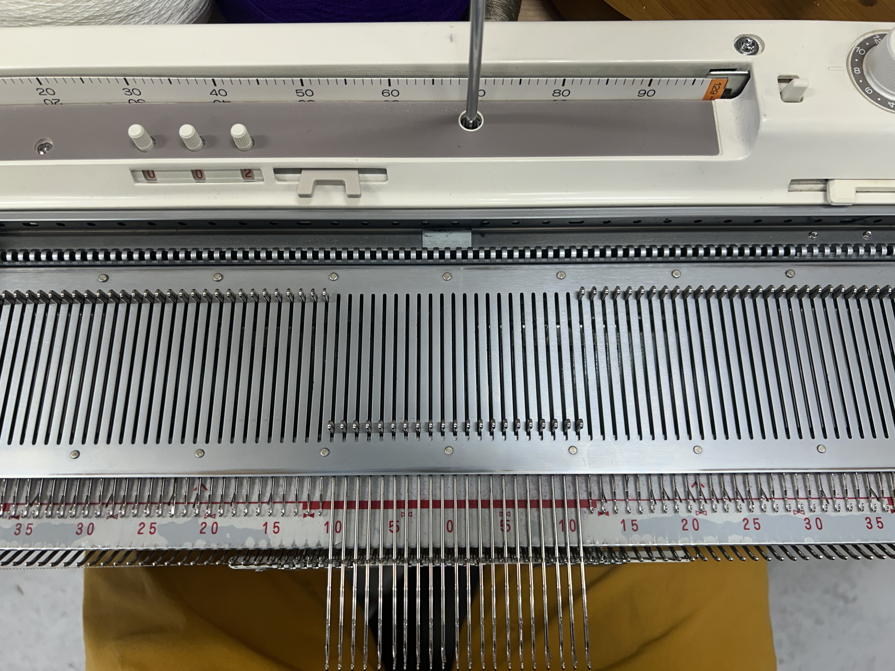
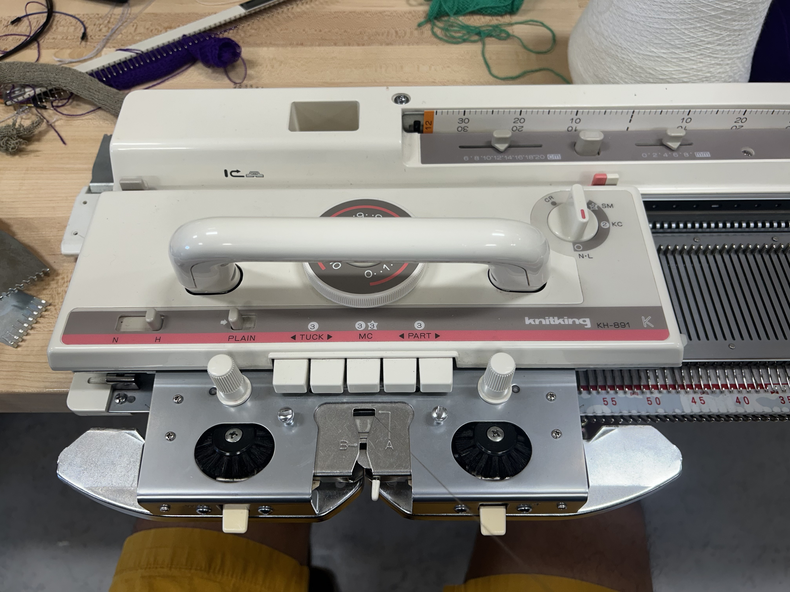
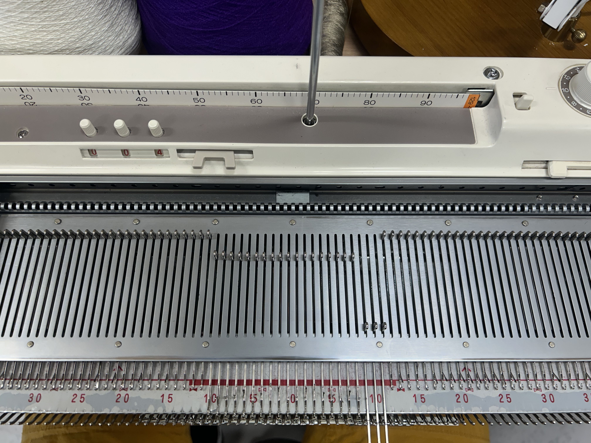
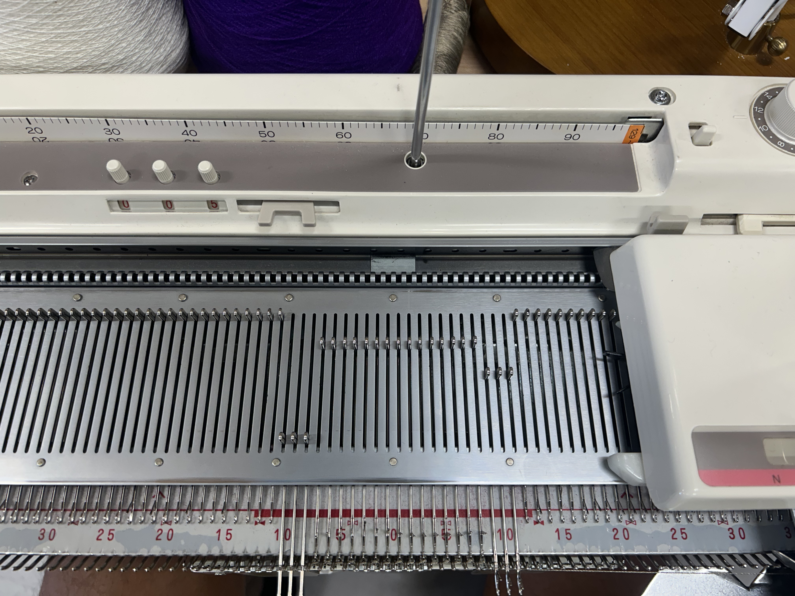
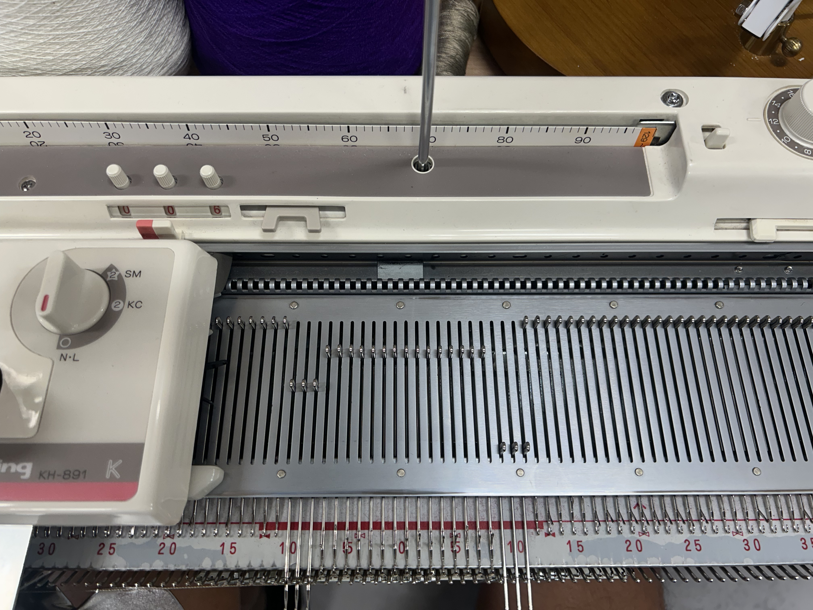

# Creating a Correctly Sized Shield For Your Patch
[back](../README.md#learn-how-to-knit-your-own-shield-here)

## What you need
### - Cast on tool 

### - Cast on comb

### - Weights

## 1. Measure Shape

- Move as many needles forward as wide as the patch ***note that shape will shrink, so maybe include 1 extra needle on each side*
- On both sides move 3-4 extra needles to counter the roll once the knit is off the machine. **Remember what you use**
## 2. Cast-On
Move all the needles forward and begin an e-wrap cast-on. Starting away from the handle, moving towards it.

<video width="500px" controls>
    <source src="images/knit/e_cast-on.mp4" type="video/mp4">
</video>

## 3. Flip Switch, Make First Pass

Flip the machine switch to 'n' and make your first pass.

## 4. Add Comb, Make Second Pass

Add the cast-on comb and make your second pass back to the side you started on.

## 5. Add Weights, Make 2 Passes

Add your weights to the comb and and make two passes, returning to the original side.

## 6. Flip Switch, Move Needles

Flip the machine switch to 'h', and move the needles on the far side out.

 In the image below the handle is on the left side, so I move 3 needles on the right side forward. 

## 7. Make Pass, Move Needles
Make one pass and position your needs as such.

## 8. Make Pass, Move Needles
Like in step 7, make one pass and position your needles as such.

## 9. Repeat steps 7-8
Repeat steps 7 and 8 as many times as you need.

## 10. Flip Switch, Make Final 2 Passes
Return the machine switch to 'n' and make two passes to complete the shape.

## 11. Cast-Off
Using the cast-off tool follow the video

<video width="500px" controls>
    <source src="images/knit/cast-off.mp4" type="video/mp4">
</video>

## Done

[back](../README.md#learn-how-to-knit-your-own-shield-here)