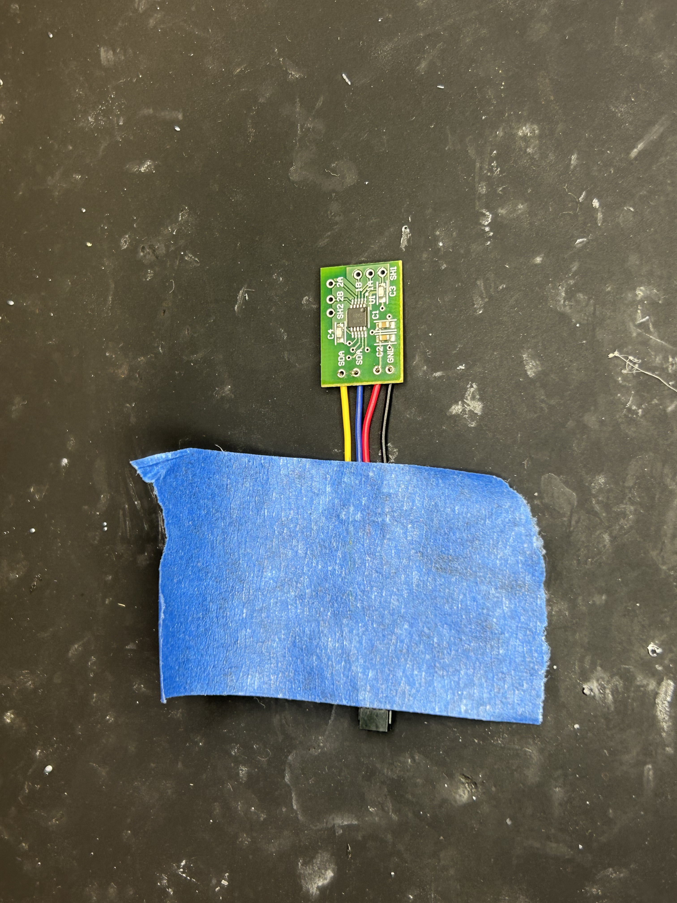
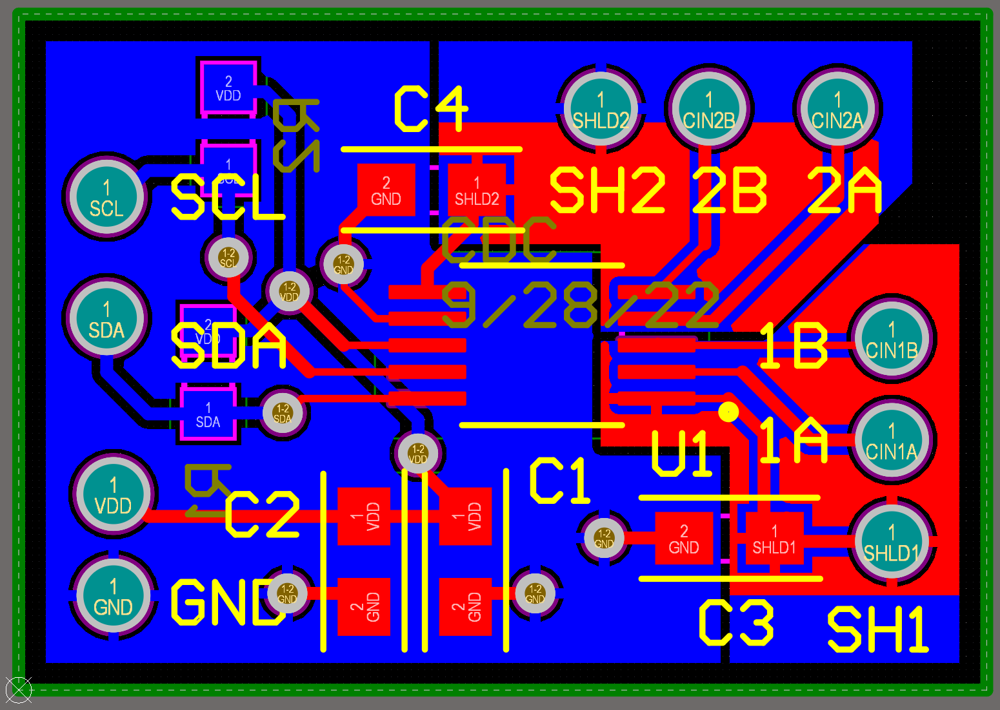
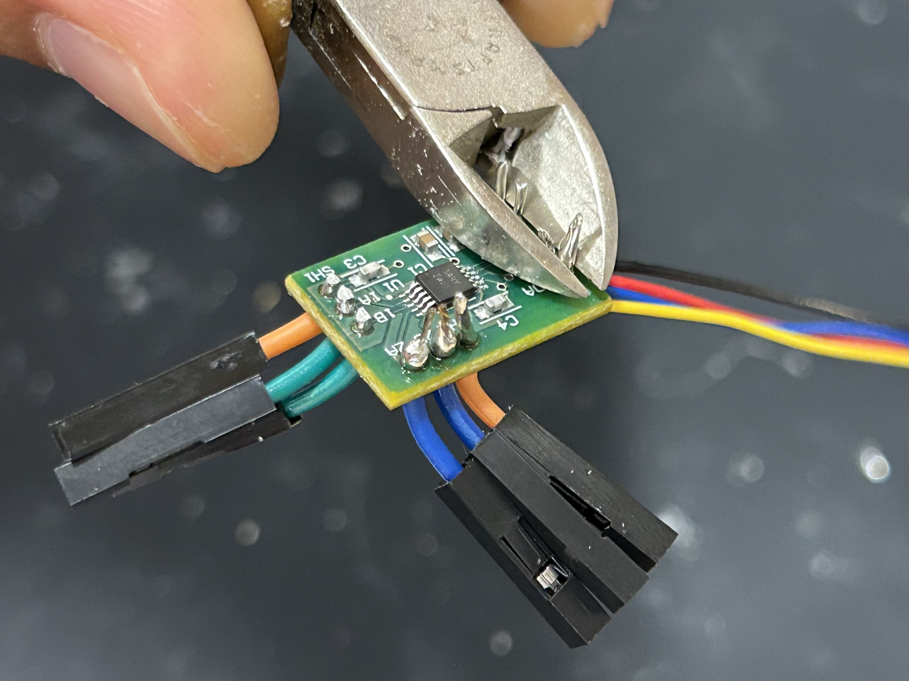
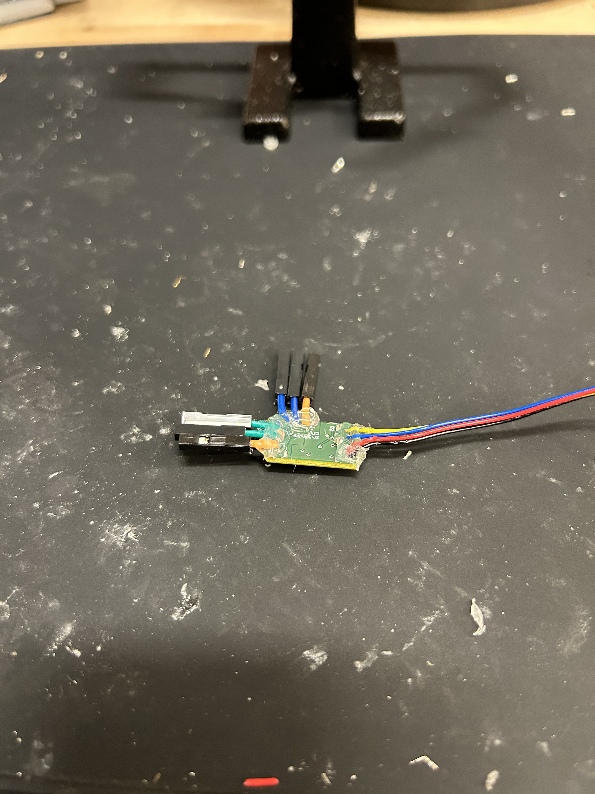

# Soldering FDC1004 PCB
[back](../README.md#fdc1004)

## 1. 

- Red - 3.3VDC Power
- Black - Ground
- Blue - I2C SDA Data
- Yellow - I2C SCL Clock

## 2.
<video width="500px" controls>
    <source src="images/chip/i2c-solder.mp4" type="video/mp4">
</video>

## 3.

## 4.

## Finished PCB

[back](../README.md#fdc1004)